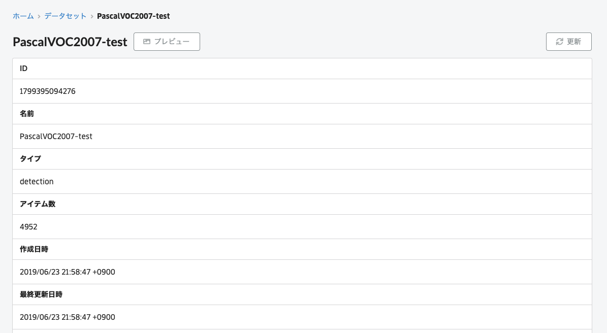
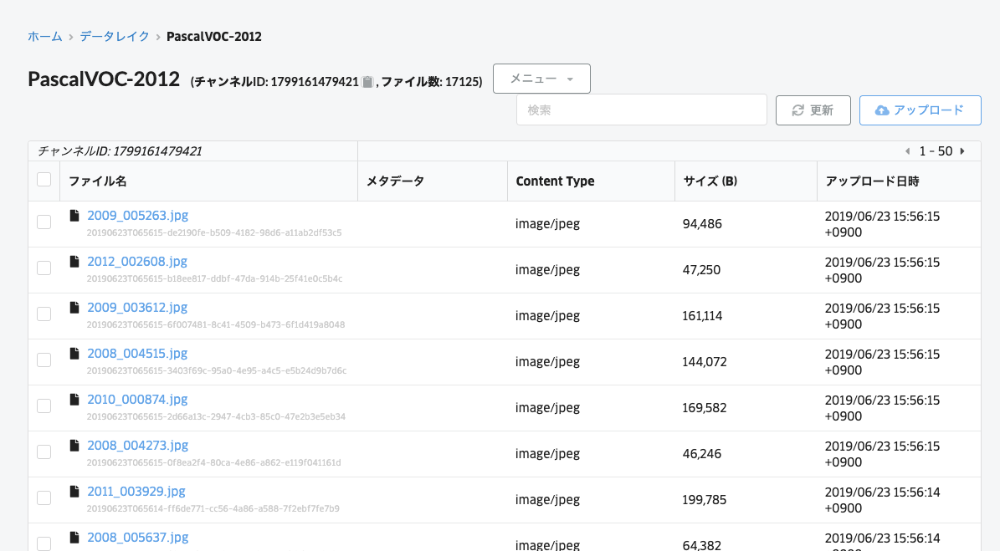
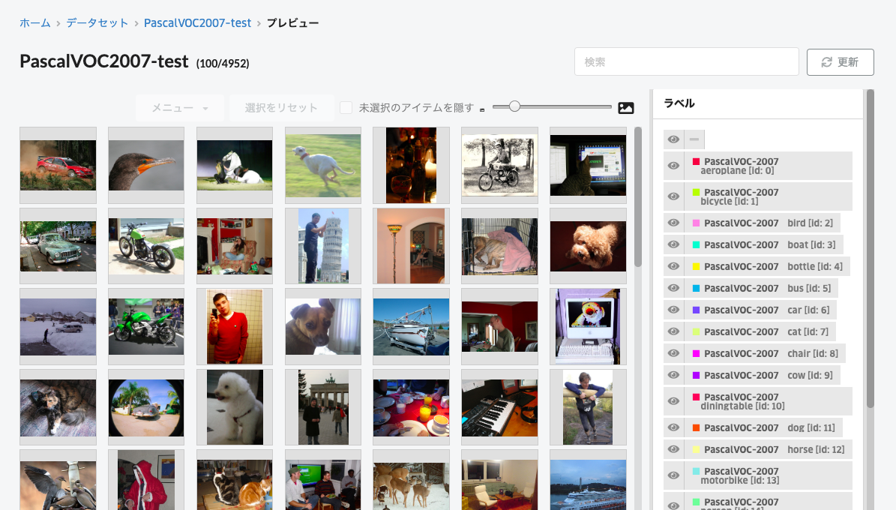

# VOC Uploader

This is data uploader of VOC dataset (for 2007 and 2012).

## How to use

### Upload image files

Just type:

```
$ sh upload.sh
```

Next check ABEJA Platform Datalake and Dataset.
Datasets have been annotated.

### Register annotation data

check `channel_id` of the uploaded data.

```
$ curl -X GET https://api.abeja.io/organizations/{ORGANIZATION_ID}/channels \
       -u user-{USER_ID}:{TOKEN} | jq '.channels[] | select (.name=="PascalVOC-2007")'

$ curl -X GET https://api.abeja.io/organizations/{ORGANIZATION_ID}/channels \
       -u user-{USER_ID}:{TOKEN} | jq '.channels[] | select (.name=="PascalVOC-2012")'
```

And upload annotation data.

```
$ python import_dataset_from_datalake.py \
          -o {ORGANIZATION_ID} \
          -c {PascalVOC-2007_ID} \
          -d PascalVOC2007-trainval \
          --split trainval \
          --year 2007 \
          --max_workers 4

$ python import_dataset_from_datalake.py \
          -o {ORGANIZATION_ID} \
          -c {PascalVOC-2007_ID} \
          -d PascalVOC2007-test \
          --split test \
          --year 2007 \
          --max_workers 4

$ python import_dataset_from_datalake.py \
          -o {ORGANIZATION_ID} \
          -c {PascalVOC-2012_ID} \
          -d PascalVOC2012-trainval \
          --split trainval \
          --year 2012 \
          --max_workers 4
```

## Example



