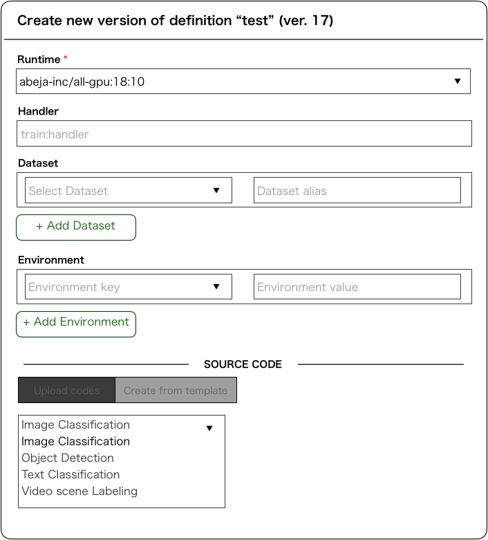

# お仕事のメモ

今回は**ABEJA PlatformへのObject Detectionのテンプレート作成**を行う。
汎用的な設計にする。

## タスク

やることとしては大きく分けて3つで、
- ABEJA PlatformのData Loaderを書く
- Detectionのアルゴリズムを書く
- Accuracy Metricの出力

## 途中で考えるべきこと

- パラメータとかは`Config.py`に外部で書き出してあげる
- モデルを入れ替え可能にしてあげる
- 藤本さんのSSDを使ってく
- 他のリポジトリを参考にしながらLoaderなど書いてく
- docstringとかコメントは丁寧に
- テストコードも並行して書き上げていく

## 完成イメージ図

## 参考実装

[https://github.com/abeja-inc/platform-template-image-classification](https://github.com/abeja-inc/platform-template-image-classification)に参考実装があるので、適宜これを参照しながら実装していく。

## 提出

[https://github.com/abeja-inc/platform-template-object-detection](https://github.com/abeja-inc/platform-template-object-detection)にてpushし、最後はmasterブランチにプルリクを出す。

作業中のブランチは`detection-template`とする。